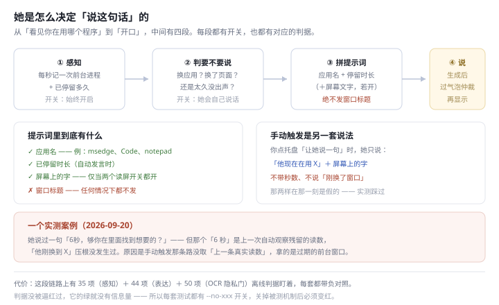
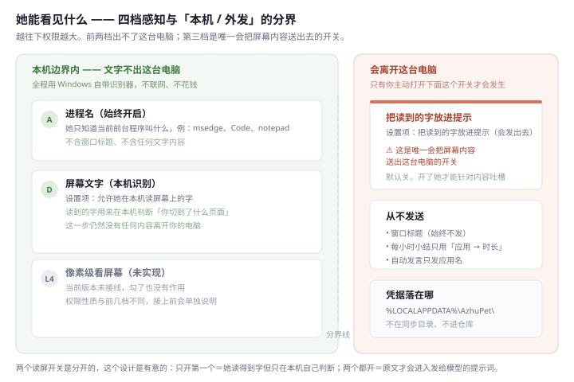
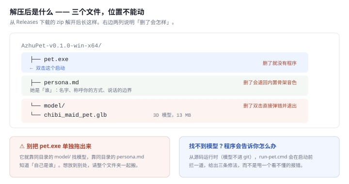
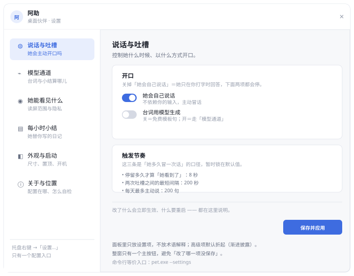
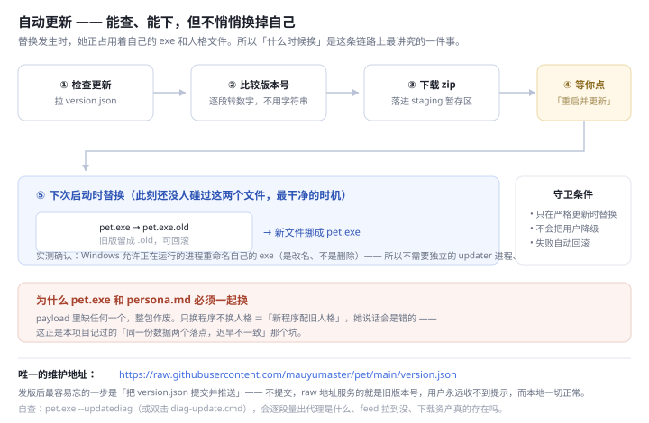

# 阿助 · 桌宠（AzhuPet）

一只会说人话的 Windows 桌宠。她不只会眨眼——她会**观察**你换了哪个窗口、**读**你屏幕上的字（可选）、**吐槽**你正在看的内容，还会**每小时写一篇**使用小结。

纯 WPF 实现（无第三方游戏引擎），代码里带着 12 套离线判据与负对照——这个项目的每一步都有"怎么验"的答案。

> 个人项目，仍在快速迭代中。Issues / PR 欢迎。

## 功能一览

- **桌面宠物**：WPF 3D 渲染、拖拽、打盹、跳跃、日夜调光、全屏自动隐退
- **自发说话**：换应用时评一句；同一应用里窗口标题变化时吐槽；长时间安静则冒一句保底
- **读屏（可选，默认关）**：Windows 自带 OCR 读屏幕文字，把内容接进她的话里——全程本机，文字不出你的电脑
- **每小时小结**：真模型替你写「这一小时做了什么」，落成 Markdown 日记
- **余额显示**：可选，支持多来源（详见下文）
- **自动更新**：会检查新版本、下载，**但换掉自己之前会问你**（详见下文）
- **人格**：她有名字（阿助）、有称呼你的方式、有说话的边界——人格文本独立成文件，改完即生效

### 她是怎么决定「说这句话」的



### 她能看见什么 —— 本机 / 外发的分界




## 系统要求

- Windows 10 19041 或更高（离线 OCR 依赖系统组件）
- [.NET 9 Desktop Runtime](https://dotnet.microsoft.com/download/dotnet/9.0)（从源码运行时需要）

## 快速开始

### 方式一：下载即用（推荐）

**[→ 打开 Releases 页](https://github.com/mauyumaster/pet/releases/latest)**，在最新一版的
`Assets` 里下载 `AzhuPet-v<版本号>-win-x64.zip`（约 18 MB）。

解压到**任意目录**（不需要是仓库、不需要管理员权限），双击 `pet.exe` 即可。

解压后应该是这样——**三个文件，请保持相对位置不变**：

```
AzhuPet-v0.1.0-win-x64/
├── pet.exe                      ← 双击这个
├── persona.md                   ← 她的人格文本（别删，删了她会退回默认音色）
└── model/
    └── chibi_maid_pet.glb       ← 3D 模型（别删，删了启动会报错退出）
```



> ⚠ **别把 `pet.exe` 单独拖出来。** 它就靠同目录的 `model/` 找模型，靠同目录的
> `persona.md` 知道「自己是谁」。挪走了会分别表现为「找不到模型」和「说话像陌生人」。
> 想放到别处，请整个文件夹一起搬。

首次运行若提示缺少运行时，装一次
[.NET 9 Desktop Runtime](https://dotnet.microsoft.com/download/dotnet/9.0)（x64）即可。

### 方式二：从源码运行（需要 .NET 9 SDK）

```bash
git clone https://github.com/mauyumaster/pet.git
cd pet
run-pet.cmd        # 会自动增量构建 Release 再启动
```

> 源码方式**不含** 3D 模型（模型 13 MB，不进 git）。`run-pet.cmd` 会在缺少模型时提示你。
> 只想用桌面宠物的话，走方式一。

首次启动：托盘出现图标。**不开模型也能玩**——默认台词是免费模板句；想要「会说人话的她」，按下文配一条模型通道。

## 开发版 vs 安装版：她该「住」在哪

仓库里那份是**开发版**。`run-pet.cmd` 每次启动都增量构建一次，所以改完代码双击就能看到效果（约 3 秒）。
但它**不适合日常用**，也不该被自更新碰 —— 它跑在 `bin\Release\...`，那是**构建产物目录**：

- `dotnet build` 会把自更新刚换进去的 `pet.exe` **覆盖回源码版本**，而 `persona.md` 不是构建产物、会留下
  ⇒ **exe 是旧的、persona 是新的**，自更新看着成功其实白做；
- 开机自启写进去的也是构建产物路径，一次 `dotnet clean` 或换一次 SDK 就**静默失效**。

所以给她一个固定的**安装位置**：

```bash
deliver.cmd        # 双击：发布 + 安装到 D:\AzhuPet\
```

装完就这三件东西（与 Release 包布局完全一致）：

```
D:\AzhuPet\
├── pet.exe
├── persona.md
└── model\chibi_maid_pet.glb
```

**桌面快捷方式、开机自启、自更新都指向这里**，三者不再互相打架。

| 你想做什么 | 用哪个 |
| --- | --- |
| 改代码、立刻看效果 | `run-pet.cmd`（跑开发树，秒级构建） |
| 让改完的成果成为「她平时用的那份」 | `deliver.cmd`（发布并安装） |
| 日常启动 | 桌面快捷方式 → `D:\AzhuPet\pet.exe` |

> ⚠ **`deliver.cmd` 要求她先退出。** `pet.exe` 运行时被文件锁占着，中途失败的复制会留下新旧混杂的文件 ——
> 那是最糟的状态，因为它看起来正常。先右键她（或托盘图标）→ 退出，再跑。
>
> 想装到别处：改 `deliver.cmd` 顶部的 `set "APPDIR=..."` 那一行即可。

> ⚠ **指向 `D:\AzhuPet\pet.exe` 的快捷方式请用资源管理器创建**（右键 `pet.exe` → 发送到 → 桌面快捷方式）。
> 本机安全策略禁止脚本创建 COM，而手写 `.lnk` 的 IDList（PIDL）极易出错 —— 踩过一次，得到一个
> 「图标空白、没有指向、双击无反应」的文件。**让 Windows 自己生成 IDList 最稳。**

## 台词模型：三种通道

| 通道 | 门槛 | 适合谁 |
| --- | --- | --- |
| **模板台词**（默认） | 零配置、零花费、逐字节可预测 | 先体验；也用作判据的对照组 |
| **OpenAI 兼容端点**（推荐） | 任意 OpenAI 兼容服务的 key | 大多数人：DeepSeek / 硅基流动 / OpenRouter / 本地 ollama 都行 |
| **Trae 通道** | 需已安装并登录 Trae，凭据从客户端抓取 | 进阶；非官方接口，随时可能失效 |

**配置入口只有一个**：托盘右键 →「设置…」——一个窗，左侧六个栏目，右侧是当前栏目的内容：



| 栏目 | 管什么 |
| --- | --- |
| 说话与吐槽 | 她会不会主动开口、换应用时评不评、安静多久冒一句 |
| 模型通道 | 台词与小结算走哪条通道（模板 / OpenAI 兼容 / Trae） |
| 她能看见什么 | 读屏开关与隐私边界、要不要把读到的字放进提示 |
| 每小时小结 | 她替你写的那篇日记：开关、时段、落到哪 |
| 外观与启动 | 尺寸、置顶、开机自启、全屏隐退 |
| 关于与位置 | 配置与数据落在哪、几个自检入口怎么跑 |

面板里只放**设置项**，不放术语解释；每栏顶上一句副标题说清它管什么。高级项默认折起（渐进披露），整窗只有一个主按钮「保存并应用」，底部常驻一条状态条说明「改了什么会立即生效、什么要重启」。

命令行等价入口（托盘够不着时用，自动化/排障方便）：

```bash
pet.exe --settings        # 直接打开设置面板
pet.exe --settingstest    # 离线验版式（13 项判据，不碰真配置）
pet.exe --fixconfig       # 修复旧版本写膨胀的 config.json（见下「自检」）
```

**配置 OpenAI 兼容通道**：设置面板的「模型通道」栏目填三项（接口地址 / 模型名 / API key）。例如 DeepSeek：`https://api.deepseek.com` ＋ `deepseek-chat` ＋ 你的 `sk-…`。本地 ollama：`http://localhost:11434` ＋ `qwen2.5` ＋ key 留 `ollama`。两项都填才走它，否则回落 Trae 通道。

命令行等价：

```bash
pet.exe --openai-base https://api.deepseek.com --openai-model deepseek-chat --openai-key sk-xxx
```

**读屏吐槽**要她「看得见」，需在设置里同时勾选：「台词用模型生成」＋「把读到的字放进提示」。只勾后者零效果（模板说话人不读屏幕文字）。

## 隐私（先说清楚她往外发什么）

- **自动发言只发应用名**（如 `msedge`→「浏览器」），**从不发送窗口标题**
- **屏幕文字**默认关闭；打开后，识别出的文字会进入模型提示——这是唯一会带内容出本机的通道，托盘菜单可随时关
- **每小时小结**只用「应用 → 时长」统计，不含标题、不含屏幕文字
- 凭据与数据全部落在 `%LOCALAPPDATA%\AzhuPet\`（不在同步目录、不进仓库）；构建脚本会在输出目录出现凭据文件时**直接报错**

## 余额显示（可选）

托盘「余额配置…」支持多来源查询（Trae / WorkBuddy / 自定义接口 / DeepSeek）。凭据只存本机。不配置则隐藏该行，不影响任何功能。

## 自检（这个项目不一样的部分）

```bash
pet.exe --watchtest      # 感知状态机 35 项
pet.exe --speaktest      # 表达链路 44 项
pet.exe --summarytest    # 小时总结 14 项
pet.exe --ocrtest        # OCR 隐私门 50 项
pet.exe --fstest         # 全屏判定 10 项
pet.exe --personatest    # 人格注入 12 项
pet.exe --eyetest        # 读屏口径 10 项
pet.exe --calibertest    # 口径一致性 39 项
pet.exe --bubbletest     # 气泡渲染
pet.exe --settingstest   # 设置面板版式 13 项
pet.exe --configtest     # 主配置转义对称性 29 项
pet.exe --updatetest     # 自更新链路 111 项（版本比较 / feed 解析 / 替换回滚）
pet.exe --spintest       # 拎起旋转 20 项（固定角加速度 / 角速度上限 / 左右半屏方向）
pet.exe --updatediag     # 自更新**联网**诊断：代理 / feed 可达 / 地址一致 / 资产存在
pet.exe --shellprobe     # 真机窗口真值探针
```

每套都带负对照（`--no-xxx`）：关掉被测机制，判据必须红——判据没被逼红过，它的绿就没有信息量。

### 配置被写坏了怎么办

历史版本有个转义不对称的 bug（写盘转义、读盘不反转义），每开一次设置面板，`vaultPath` 的
反斜杠就翻一倍，文件指数膨胀。极端情况下 `config.json` 涨到 **268 MB**，而面板打开时要对
这段文本做排版量算 ⇒ **稳定卡 16 秒**，症状看上去只是「打开设置要等很久」。

现在修好了（读写两侧成对转义，且打开面板时自愈），但如果你的机器上还留着旧版本的
膨胀文件，跑一次：

```bash
pet.exe --fixconfig       # 备份 + 把膨胀的 vaultPath 重置为默认（其余设置原样保留）
```

⚠ 膨胀的路径**无法还原**成原值（多出来的反斜杠把路径段落吃掉了），所以是重置为默认库路径，
不是「修回你原来写的那个路径」——若你曾自定义过库路径，修复后到设置面板重填一次即可。

## 自动更新

她**会检查更新，但不会背着你换掉自己**——下载可以自动，替换要你点一下。



### 用户视角

托盘 →「设置…」→「关于与位置」页顶部有「版本与更新」卡片：显示当前版本、一个「检查更新」按钮。
有新版时出现「下载更新」→ 下完后按钮变成「重启并更新」。点它，程序退出、下一次启动就是新版。

也会**静默检查**：启动时若发现上一次已经下好了新版本，直接就地换上（此时还没人碰过 exe 和
`persona.md`，是最干净的时机）。

### 为什么不自己偷偷重启

- 「下载完不替换、下次启动才替换」——下载那一刻，`pet.exe` 正被自己占用、`persona.md` 可能
  正被读；留到下次启动、在任何代码碰这两个文件之前做，最干净。
- **实测确认**：Windows 允许正在运行的进程**重命名自己的 exe**（不是删、是改名）。这条事实
  决定了不需要独立 updater 进程、不需要批处理、不需要辅助脚本——`ApplyPending` 就在进程内
  把 `pet.exe` → `pet.exe.old`，再把新文件挪成 `pet.exe`。失败会回滚。
- **不会把用户降级**：只有远端版本比当前**严格更新**才替换。
- **两个文件必须一起换**：payload 里缺 `pet.exe` 或缺 `persona.md`，整包作废。只换程序不换人格
  ＝「新程序配旧人格」，她说话会是错的——这正是本项目记过的「同一份数据两个落点」坑。

### 更新源（唯一需要维护的地址）

```
https://raw.githubusercontent.com/mauyumaster/pet/main/version.json
```

`version.json` 长这样（由 `pack-release.cmd` 自动生成）：

```json
{
  "version": "0.1.0",
  "url": "https://github.com/mauyumaster/pet/releases/download/v0.1.0/AzhuPet-v0.1.0-win-x64.zip",
  "notes": ""
}
```

⚠ 三个易错点，判据都守着：

1. **别猜仓库名，去看 `git remote -v`**——本项目**真踩过**：本地文件夹叫「阿助娘化形象」、
   C# 命名空间叫 `AzhuPet`，于是更新源写成了 `mauyumaster/AzhuPet`。但 GitHub Desktop
   是用**文件夹名**建的仓，线上其实是 `mauyumaster/pet`。两个地址都「看起来对」，
   而 `raw.githubusercontent.com` 路径**区分大小写**、写错就 404 —— 404 在这条链路上
   只表现成「检查更新失败」，看不见「地址写错了」。
   现在判据会**直接读 `.git/config` 里的 remote 地址来比对**，而不是只跟硬编码字符串比
   （跟硬编码比＝验证副本，仓库改名时照样全绿）。
2. **版本号不能按字符串比大小**——`"0.10.0"` 用字符串比会被判**旧于** `"0.9.0"`（`'1' < '9'`）。
   症状是「明明有新版本却永远不提示」，且只在跨两位数时出现。代码里是逐段转数字比。
3. **`--version` 只输出 LF、只输出一行**——`WriteLine` 在 Windows 上吐 CRLF，`pack-release.cmd`
   用 `for /f` 抓它，一旦把 CR 带进变量，生成的文件名会变成 `AzhuPet-v0.1.0␍-win-x64.zip`
   （带隐形字符）。所以是从 `Console.OpenStandardOutput()` 手写 ASCII 字节。

### 检查更新失败？先跑诊断

**双击 `diag-update.cmd`** —— 它会跑下面那条命令、把结果留在窗口里（`pause` 不关窗），
最后一行直接给 PASS / FAIL。不用记路径。

或者手动：

```bash
pet.exe --updatediag
```

它逐段量出**代理是什么、feed 拉到没、地址与 `git remote` 一致吗、下载资产真的存在吗**，
每条失败都告诉你下一步该查什么。真实例子（2026-09-21）：诊断报出

```
本进程的代理 : http://127.0.0.1:61827（走环境变量 HTTPS_PROXY）
失败：网络不可达 —— 系统代理是 http://127.0.0.1:61827…请关掉代理再试
```

那个端口**根本没有进程在听**（Clash 实际在 7897）——是某个已关闭程序留下的环境变量。

> ⚠ 诊断里的「本进程的代理」是**本进程**看到的，不一定是全局真相。Windows 上代理有三级：
> **用户级环境变量 → 机器级环境变量 → 系统（IE）设置**。若诊断报的代理和你以为的不一样，
> 按这个顺序查。反过来：某个终端里报错，不代表你双击运行时也会错。
没有这段诊断，这件事只能靠猜。

### 发一版新版

```bash
# 1. 改版本号（唯一来源）
#    pet.csproj  <Version>0.1.0</Version>   →   0.2.0

pack-release.cmd        # 2. 生成 AzhuPet-v0.2.0-win-x64.zip + 更新 version.json
```

3. 在 GitHub 上建一个 Release，**tag 必须写 `v0.2.0`**（与版本号一致，`pack-release.cmd` 把
   tag 拼进了下载地址，写错就 404），把 zip 传上去当附件。
4. **把 `version.json` 提交并推送**——这一步最容易忘。不提交，raw 地址服务的就是旧版本号，
   用户永远收不到更新提示，而本地一切正常。
5. 自查一次：`pet.exe --updatediag`。它会告诉你代理是什么、feed 拉到没、地址与 git remote
   一致吗、**下载资产真的存在吗**（HEAD 探测）。第 4 步忘了提交的话，这里会立刻显形。

## 构建 / 发布

```bash
dotnet build -c Release        # 只编译
pack-release.cmd               # 发布：编译 + 单文件 + 打包 zip + 生成 version.json（推荐）
```

`pack-release.cmd` 一条命令做完六件事：从**已构建的 exe** 读版本 → publish 单文件 →
把 `persona.md` 拷到 exe 同目录 → **把 `../model/chibi_maid_pet.glb` 拷进 `model/`** →
**守卫检查三个文件都在** → 打 zip → 写 `version.json`。手工 publish 会漏掉后半段，而漏掉是
**静默**的：解压后程序照跑、照说话，只是退回内置骨架音色；漏掉模型更糟——**双击直接弹
「找不到 model/chibi_maid_pet.glb」然后退出**。所以这一步不该由人记。

> ⚠ 模型文件住在 `pet` 的**父目录**（`阿助娘化形象/model/`，13 MB，不进 git），所以脚本里写的是
> `..\model\chibi_maid_pet.glb`。它必须出现在 zip 里的 `model/` 子目录下，与 `pet.exe` 并排——
> 程序找模型时**优先看 exe 同目录**。

> 版本号从 exe 里读（`pet.exe --version`），不在脚本里另存一份。**版本号的唯一来源是
> `pet.csproj` 的 `<Version>`**。若脚本自己也记一份，就可能出现「exe 说 0.2.0、feed 说 0.1.0」，
> 更新器要么永远不提示、要么永远提示同一个。问二进制要版本，这件事就不可能发生。

产物 `AzhuPet-v0.1.0-win-x64.zip`（约 39 MB，框架依赖，需用户自装 .NET 9 Desktop Runtime），
内容三个文件：`pet.exe` ＋ `persona.md` ＋ `model/chibi_maid_pet.glb`。zip 已被 `.gitignore`
排除，挂到 GitHub Release 页即可，不进 git 历史。

底层等价命令（自己组合时别漏 `persona.md` 和模型）：

```bash
dotnet publish -c Release -r win-x64 --self-contained false -p:PublishSingleFile=true
```

> ⚠ Git Bash 里必须写 `-p:` 而不是 `/p:` —— 斜杠形式会被 shell 当成路径吞掉，报
> `MSB1009: 项目文件不存在`，看着像项目坏了，其实是参数没传进去。

## License

- **代码**：[MIT](LICENSE)
- **人格文本**（`persona.md`，她的自我认知与说话方式）：[CC BY-NC-SA 4.0](https://creativecommons.org/licenses/by-nc-sa/4.0/deed.zh) —— 非商业使用、署名、相同方式共享。这是「她是谁」的一部分，请像对待角色设定一样对待它。
