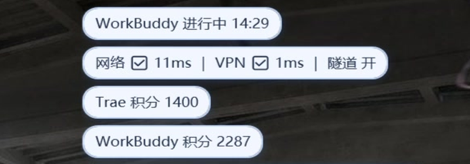
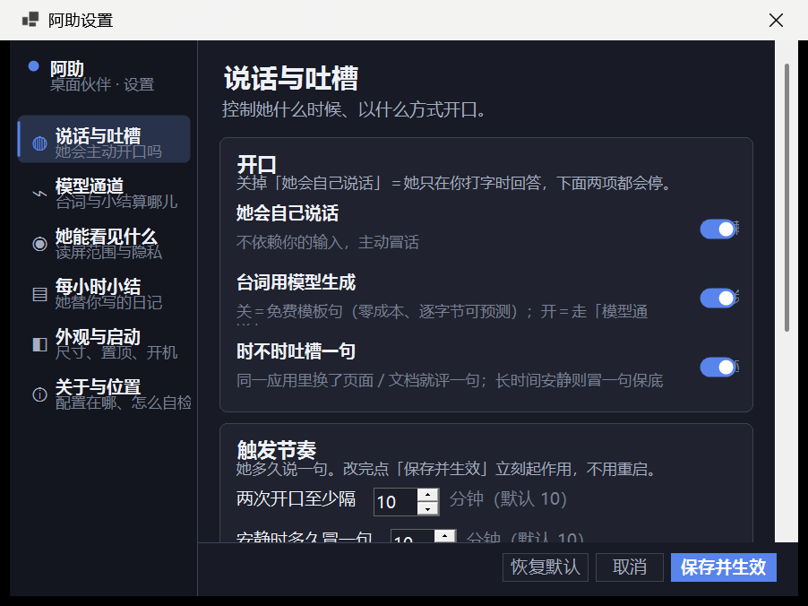
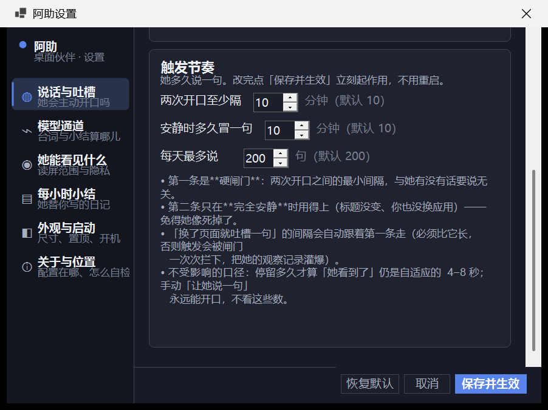

<div align="center">


# 阿助 · 桌宠

**一只住在你 Windows 桌面上的小家伙。**
她知道你在用哪个软件、会主动说两句、每天替你记一笔，
还会顺手把 TRAE / WorkBuddy / Codex 的任务耗时摆在你眼前。

个人项目，一直在更新。装起来只要一分钟 ↓

</div>

---

## 她长这样


> 上面那条小气泡是她主动说的话，底下那个是**她本人** —— 3D 的、会眨眼、会转头看你。

## 她会做什么

| | 她做的事 |
| --- | --- |
| 💬 | **主动搭话** —— 你换了软件她评一句，同一软件里翻了页她吐槽一句，安静久了冒个泡 |
| 👀 | **看得见（可选）** —— 打开后能读屏幕上的字，把内容接进她的话里。读这一步全程在你电脑本地 |
| 📓 | **每小时小结** —— 用真模型替你写「这一小时干了啥」，存成 Markdown 日记 |
| ⏱ | **任务计时读数** —— TRAE / WorkBuddy / Codex 现在跑到第几分钟、刚跑完用了多久，直接显示在气泡顶上 |
| 💰 | **余额显示（可选）** —— Trae / WorkBuddy 的剩余积分摆在眼前，不用来回切窗口 |
| 🎭 | **她有性格** —— 有名字、有称呼你的方式、有说话的边界。人格文本单独一个文件，想改就改 |
| 🔄 | **自动更新** —— 会检查、会下载，但**换掉自己之前一定先问你** |

<div align="center">



<sub>双击她，或者托盘菜单「状态…」，就会浮出这么一条：网络 / VPN / 隧道 / 积分 / 任务耗时</sub>

</div>

## 一分钟用起来

**[→ 打开下载页](https://github.com/mauyumaster/pet/releases/latest)**，看最新一版的 `Assets`，二选一：

| 挑这个 | 适合 |
| --- | --- |
| `AzhuPet-…-setup.exe`（约 17 MB） | **新用户**。有安装向导，会帮你查运行环境，装完有桌面图标和卸载项 |
| `AzhuPet-…-win-x64.zip`（约 18 MB） | 想**解压就用**、不装任何东西的人 |

装之前要有一件东西：[.NET 9 Desktop Runtime（x64）](https://dotnet.microsoft.com/download/dotnet/9.0)。
安装程序会替你查，缺了会提示你打开下载页；便携版缺运行时的表现是「双击没反应」。

### 选便携版的话

解压到**任意文件夹**，双击 `pet.exe`。解压出来应该是这样，**四个东西要放在一起，别单独把 exe 拖走**：

```
AzhuPet-v0.1.4-win-x64/
├── pet.exe                  ← 双击这个
├── persona.md               ← 她的人格（删了她会变成「陌生人音色」）
├── WebView2Loader.dll       ← 浏览器登录用（别删）
└── model/
    └── chibi_maid_pet.glb   ← 3D 模型（删了启动会报错）
```

> 想换个地方放？**整个文件夹一起搬。**

### 想让「她真的会说话」

默认台词是免费模板句。想要有性格的那种，配一条模型通道就行 —— 见下面「设置」。
**不配也能用**，只是她说得比较朴素。

## 设置：一个窗口，七栏

托盘图标右键 →「设置…」。左栏切栏目，右边改内容，改完点右下角**「保存并生效」**。

<div align="center">



<sub>「模型通道」——台词和每小时小结走哪条通道：模板句 / OpenAI 兼容端点 / Trae</sub>

</div>

| 栏目 | 管什么 |
| --- | --- |
| **说话与吐槽** | 她会不会主动开口、换软件时评不评、多久冒一句 |
| **模型通道** | 台词和小时结算走哪条通道（模板 / OpenAI 兼容 / Trae） |
| **她能看见什么** | 读屏开关、隐私边界 |
| **每小时小结** | 她那篇日记：开关、间隔、存到哪 |
| **外观与启动** | 大小、置顶、开机自启、全屏隐藏、任务计时读数的开关 |
| **余额与凭据** | 气泡里那几个数字从哪来 |
| **关于与位置** | 文件都在哪、怎么自检、检查更新 |

<div align="center">



<sub>「外观与启动」——大小三档、始终置顶、夜间调光、开机自启；改完点「保存并生效」</sub>

</div>

**先说她多久开口 ——「说话与吐槽」栏那三个旋钮**（最常被问的一个问题）：

| 旋钮 | 默认 | 管什么 |
| --- | --- | --- |
| 两次开口至少隔 | 10 分钟 | 硬闸门：她两次开口之间的最小间隔，跟她有没有话要说无关 |
| 安静时多久冒一句 | 10 分钟 | 只在**完全安静**时用得上（标题没变、你也没换应用）——免得她像死掉了 |
| 每天最多说 | 200 句 | 一天的主动发言上限 |

**配模型通道**（大多数人选这个）：进「模型通道」栏，填三项 —— 接口地址、模型名、API key。比如：

| 服务 | 地址 | 模型名 | key |
| --- | --- | --- | --- |
| DeepSeek | `https://api.deepseek.com` | `deepseek-chat` | 你的 `sk-…` |
| 本地 ollama | `http://localhost:11434/v1` | `qwen2.5` | 随便填 `ollama` |

<details>
<summary>⚠ 配 ollama 的两个小坑（点开）</summary>

- 地址**要带 `/v1`** —— 程序只往后面接 `/chat/completions`，漏了会 404。
- **必须填个占位 key**（比如 `ollama`）。不填会**静默**回落到 Trae 通道，现象只是「模型没换」—— 不报错，很难查。

</details>

## 交互

她能接住的动作不多，但每个都是**一眼就懂**的那种：

| 你想干什么 | 怎么做 |
| --- | --- |
| 让她挪个窝 | **按住拖动**。移动超过一点点就算「拎起来」—— 她会就地转一圈，松手甩出去还会自己落地 |
| 看她现在怎么样 | **双击她** → 顶上弹一条状态气泡（就是上面那张图里那行读数） |
| 逗她一下 | **点一下**（不拖动）→ 她跳一下 |
| 跟她说句话 | 右键她 →「和桌宠说话…」，弹出聊天窗，回车发送 |
| 让她主动开腔 | 右键她 →「让她说一句」 |
| 暂时别挡路 | 右键她 →「隐藏阿助」，或者干脆让**全屏自动隐退**替你管 |

> **右键她本人 = 右键托盘图标**，弹出的是同一个菜单（里面还有大小、鼠标穿透、打个盹、设置…）。
> 也可以 `pet.exe --settings` 直接开设置面板。

## 隐私：她往外发什么

<div align="center">


</div>

- **自动发言只发应用名**（比如「浏览器」），**从不发窗口标题**
- **屏幕文字默认关**。打开后识别到的文字会进模型提示 —— 这是唯一会把内容带出你电脑的通道，托盘菜单随时可关
- **每小时小结**只用「应用 → 时长」统计，**不含标题、不含屏幕文字**
- **凭据和数据**都放在 `%LOCALAPPDATA%\AzhuPet\`，不在同步目录、不进仓库

## 常见问题

<details>
<summary><b>双击没反应 / 弹了个看不懂的框</b></summary>

缺 [.NET 9 Desktop Runtime](https://dotnet.microsoft.com/download/dotnet/9.0)（x64）。装一次就好。

</details>

<details>
<summary><b>更新点了没反应，或者一直停在旧版本</b></summary>

多半是她被装到了写不进去的地方（比如 `Program Files`）。**别选「给所有用户安装」** ——
装到 `Program Files` 之后自更新会永久失效，而且往往**一声不吭**。

正解：装到默认位置（`%LOCALAPPDATA%\Programs\AzhuPet`，不需要管理员权限），或者整个文件夹解压到你自己的目录。

</details>

<details>
<summary><b>检查更新失败</b></summary>

双击仓库里的 **`diag-update.cmd`**（或跑 `pet.exe --updatediag`），它会自己跑一遍诊断、
把结果留在窗口里，最后一行直接告诉你行不行。
最常见的原因是**系统代理**指向了一个没在用的端口 —— 诊断会当场把那串地址打出来。

</details>

<details>
<summary><b>设置面板打开很慢</b></summary>

旧版本写配置文件时有个转义 bug，会让文件膨胀（极端能到几百 MB）。
跑一次 `pet.exe --fixconfig` 修一下（会先备份，其它设置原样保留）。

</details>

<details>
<summary><b>她有时不开口</b></summary>

检查「说话与吐槽」栏：`她会自己说话` 和 `台词用模型生成` 要都打开；另外「触发节奏」里的间隔别设太长。
当前默认是**十分钟一句**，可以在面板里调。

</details>

<details>
<summary><b>想让她别说话 / 想退出</b></summary>

托盘图标右键 →「设置…」→「说话与吐槽」，把 `她会自己说话` 关掉，她就只在你打字时回你。
要彻底关掉：托盘右键 →「退出」。

</details>

---

<details>
<summary><b>给折腾的人（技术细节，正常使用不用点）</b></summary>

**自己构建**

```bash
git clone https://github.com/mauyumaster/pet.git
cd pet
run-pet.cmd          # 增量构建 Release 再启动（约 3 秒）
```

源码方式**不含** 3D 模型（13 MB，不进 git）。

**仓库里的开发脚本**（不随发布件分发）

| 想做什么 | 用哪个 |
| --- | --- |
| 改代码、立刻看效果 | `run-pet.cmd` |
| 让改完的成果成为「她平时用的那份」 | `deliver.cmd`（发布并装到 `D:\AzhuPet`） |
| 打包发版 | `pack-release.cmd`（编译 + zip + 安装程序 + `version.json`） |

> ⚠ `pack-release.cmd` 一条命令做完八件事，包括几个**漏了会静默坏掉**的检查
> （`persona.md` 和 3D 模型必须落在 exe 旁边，否则发布包照跑、只是她变了个人 / 直接报错）。
> 本机构建请带 `-p:UseSharedCompilation=false`，否则 `dotnet build` 会挂住。

**版本号唯一来源**是 `pet.csproj` 的 `<Version>`，另有三处要跟着改：
`trae-ext/package.json`、`TraeExtInstaller.Version`、`version.json`。
打包脚本从**已构建的 exe** 读版本，避免「exe 说 0.2.0、feed 说 0.1.0」。

**发一版新版**

1. 改 `pet.csproj` 的 `<Version>`
2. `pack-release.cmd`
3. 到 GitHub 建 Release（**tag 必须写 `v<版本号>`**），**zip 和 setup 都传**
4. **提交并推送 `version.json`**（最容易忘的一步）
5. `pet.exe --updatediag` 自查一次

> ⚠ **两个资产都得传，zip 尤其不能省。** 已装用户的「检查更新」下载的是 **zip**
> （`version.json` 里硬指向它，跟当初怎么装的无关）—— 少传 zip ＝ 所有老用户点「更新」都 404。
> setup 是给新用户的（向导 / .NET 检测 / 卸载项）。

> ⚠ **顺序别反：先建 Release、传完资产，再推 `version.json`。** 反了会出现
> 「线上报有新版本、release 还不存在」的故障窗口，所有人点下载都 404。本项目真发生过一次。


**为什么更新只能走 zip**：自更新是原地替换「正在运行的自己」所在目录里的文件，
必须无人值守、可回滚、不碰注册表、不弹 UAC；安装程序恰恰相反（每一步都要人点头）。

**自检**：这个项目的每一步都有「怎么验」的答案。二十多套离线判据，每条都带负对照 ——
关掉被测机制，判据必须变红；没被逼红过的绿没有信息量。

```bash
pet.exe --watchtest        # 感知状态机 35 项
pet.exe --speaktest        # 表达链路 64 项
pet.exe --settingstest     # 设置面板版式 16 项
pet.exe --agenttimertest   # 多 agent 任务计时 34 项
pet.exe --updatetest       # 自更新链路 115 项
pet.exe --llmtest          # 真调模型，验网络那半段（会打印实际走的通道）
pet.exe --settings         # 打开设置面板
pet.exe --fixconfig        # 修复膨胀的 config.json
pet.exe --updatediag       # 诊断「为什么检查更新失败」
```

> 这只是其中几套。完整清单在 `Program.cs` / `Config.cs` 里搜 `--`，二十多个开关。

> ⚠ 判据跑在**你自己的环境**里，所以有一条机制挡着它们往真配置写东西
> （历史上真被写坏过一次，见「常见问题」里的旧版膨胀 bug）。

**她说一句话的链路**：


</details>

## 授权

- **代码** — [MIT](LICENSE)
- **人格文本**（`persona.md`）—— [CC BY-NC-SA 4.0](https://creativecommons.org/licenses/by-nc-sa/4.0/deed.zh)。
  这是「她是谁」的一部分，请像对待角色设定一样对待它
- **形象**（`model/chibi_maid_pet.glb`）—— **不是本项目原创**，版权链与出处见仓库内
  `40 Projects/阿助（桌宠）/她是谁.md` §9。使用与再分发**必须署名原作者、不得商用、衍生作品须同协议共享**（CC BY-NC-SA 4.0）

---

<div align="center">
<sub>Issues / PR 都欢迎 · 她还在长大</sub>
</div>
