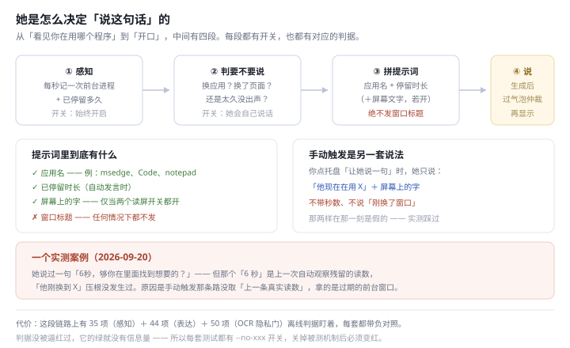
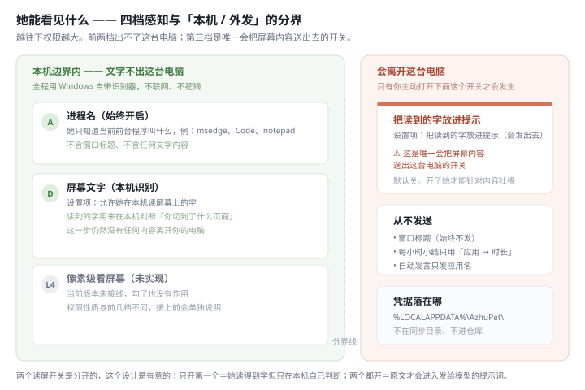
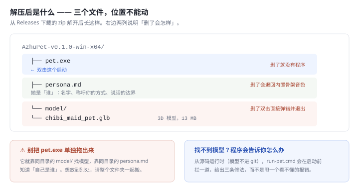
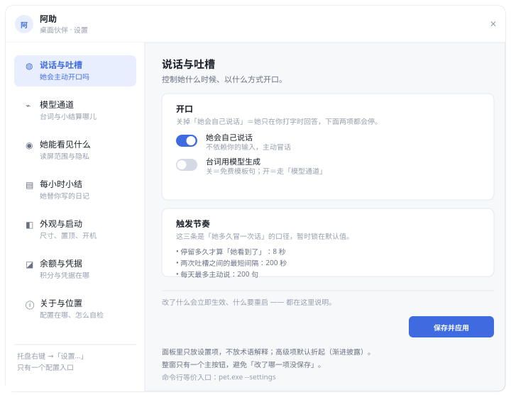
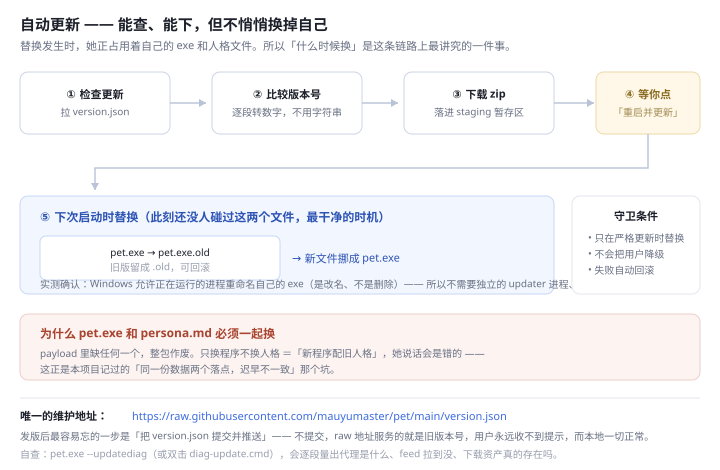

# 阿助 · 桌宠（AzhuPet）

一只会说人话的 Windows 桌宠。她不只会眨眼——她会**观察**你换了哪个窗口、**读**你屏幕上的字（可选）、**吐槽**你正在看的内容，还会**每小时写一篇**使用小结。

纯 WPF 实现（无第三方游戏引擎），代码里带着 15 套离线判据与负对照——这个项目的每一步都有"怎么验"的答案（清单见下文「自检」，每条都能自己跑）。

> 个人项目，仍在快速迭代中。Issues / PR 欢迎。

## 功能一览

- **桌面宠物**：WPF 3D 渲染、拖拽、打盹、跳跃、日夜调光、全屏自动隐退
- **自发说话**：换应用时评一句；同一应用里窗口标题变化时吐槽；长时间安静则冒一句保底
- **读屏（可选，默认关）**：Windows 自带 OCR 读屏幕文字，把内容接进她的话里——全程本机，文字不出你的电脑
- **每小时小结**：真模型替你写「这一小时做了什么」，落成 Markdown 日记
- **余额显示**：可选，支持多来源（详见下文）
- **自动更新**：会检查新版本、下载，**但换掉自己之前会问你**（详见下文）
- **人格**：她有名字（阿助）、有称呼你的方式、有说话的边界——人格文本独立成文件，改完即生效

### 她是怎么决定「说这句话」的



### 她能看见什么 —— 本机 / 外发的分界




## 系统要求

- Windows 10 19041 或更高（离线 OCR 依赖系统组件）
- [.NET 9 Desktop Runtime](https://dotnet.microsoft.com/download/dotnet/9.0) **x64** ——
  两个发布件都是「框架依赖」的，**都要它**（自带运行时的自包含版没有做）

> 安装程序会在装之前替你查一遍（注册表和文件系统两处都查，见 `installer/azhupet.iss` 的
> `HasDotNetDesktop`），查不到会问你要不要打开官方下载页；zip 便携包没有这个环节，
> 缺运行时的表现是「双击没反应」或者一个看不懂的框。

## 快速开始

每次发版上传**两个文件**，它们面向两个不同的起点，按你的情况选一个：

| 文件 | 给谁 | 大小 | 装完能自更新吗 |
| --- | --- | --- | --- |
| `AzhuPet-v<版本号>-win-x64-setup.exe` | **新用户**。有向导、.NET 检测、桌面图标、开始菜单、卸载项 | 约 17 MB | ✅ 能（默认装到用户目录） |
| `AzhuPet-v<版本号>-win-x64.zip` | 想**免安装**、解压就用的人；**同时也是自更新的唯一载体** | 约 18 MB | ✅ 能 |

**[→ 打开 Releases 页](https://github.com/mauyumaster/pet/releases/latest)**，在最新一版的
`Assets` 里挑一个下载。

> ⚠ **两个都要传，不是因为冗余。** 她已经装好之后，面板里的「检查更新」下的是 **zip**——
> `version.json` 里的地址硬指向 zip，跟当初怎么装的无关。所以 **zip 必须留在 Release 页上**，
> 哪怕你自己是用 setup 装的；反过来，setup 让新用户省掉「解压、找目录、自己确认运行时」
> 这几步。**少传 zip＝所有已装用户点「检查更新」都会 404。**

### 方式一：运行安装程序（推荐给新用户）

下载 `…-setup.exe` 双击。向导除了许可协议页（代码 MIT ＋ 人格 CC BY-NC-SA 的合并说明），
你实际要做决定的只有三处：

1. **装到哪** —— 默认 `%LOCALAPPDATA%\Programs\AzhuPet`，**不需要管理员权限**
2. **要不要桌面图标** —— 默认勾上
3. **要不要开机自启** —— 默认不勾（之后可在设置面板改）

装完会问你要不要立刻启动。桌面上那个图标的工作目录是安装目录本身，所以 `model/` 和
`persona.md` 都找得到（这条在工作目录上是踩过坑的，见 `installer/azhupet.iss` 的 `[Icons]`）。

> ⚠ **别选「给所有用户安装」**（向导里的选项，或命令行 `/ALLUSERS`）。装到 `Program Files`
> 之后，她的自更新会**永久失效**——不是报错，是「更新走完了、版本号没变」。
> 原因见下文「为什么别装到 `Program Files`」。

### 方式二：解压即用（便携）

下载 `…-win-x64.zip`，解压到**任意目录**（不需要是仓库、不需要管理员权限），双击 `pet.exe` 即可。

解压后应该是这样——**四个文件，请保持相对位置不变**：

```
AzhuPet-v0.1.2-win-x64/
├── pet.exe                      ← 双击这个
├── persona.md                   ← 她的人格文本（别删，删了她会退回默认音色）
├── WebView2Loader.dll           ← 浏览器登录要用的原生库（别删，删了那条路直接报错）
└── model/
    └── chibi_maid_pet.glb       ← 3D 模型（别删，删了启动会报错退出）
```



> ⚠ **别把 `pet.exe` 单独拖出来。** 它就靠同目录的 `model/` 找模型，靠同目录的
> `persona.md` 知道「自己是谁」。挪走了会分别表现为「找不到模型」和「说话像陌生人」。
> 想放到别处，请整个文件夹一起搬。

首次运行若提示缺少运行时，装一次
[.NET 9 Desktop Runtime](https://dotnet.microsoft.com/download/dotnet/9.0)（x64）即可。

### 方式三：从源码运行（需要 .NET 9 SDK）

```bash
git clone https://github.com/mauyumaster/pet.git
cd pet
run-pet.cmd        # 会自动增量构建 Release 再启动
```

> 源码方式**不含** 3D 模型（模型 13 MB，不进 git）。`run-pet.cmd` 会在缺少模型时提示你。
> 只想用桌面宠物的话，走方式一或方式二。

首次启动：托盘出现图标。**不开模型也能玩**——默认台词是免费模板句；想要「会说人话的她」，按下文配一条模型通道。

## 开发版 vs 安装版：她该「住」在哪

> 这一节是给**改代码的人**看的。只想用她的话，走上面的方式一（安装程序）或方式二（便携），
> 不用管 `run-pet.cmd` / `deliver.cmd` 这两个脚本——它们是仓库里的开发工具，不随发布件分发。

仓库里那份是**开发版**。`run-pet.cmd` 每次启动都增量构建一次，所以改完代码双击就能看到效果（约 3 秒）。
但它**不适合日常用**，也不该被自更新碰 —— 它跑在 `bin\Release\...`，那是**构建产物目录**：

- `dotnet build` 会把自更新刚换进去的 `pet.exe` **覆盖回源码版本**，而 `persona.md` 不是构建产物、会留下
  ⇒ **exe 是旧的、persona 是新的**，自更新看着成功其实白做；
- 开机自启写进去的也是构建产物路径，一次 `dotnet clean` 或换一次 SDK 就**静默失效**。

所以给她一个固定的**安装位置**：

```bash
deliver.cmd        # 双击：发布 + 安装到 D:\AzhuPet\
```

装完就这四件东西（与 Release 包布局完全一致，也和安装程序的 `[Files]` 一致）：

```
D:\AzhuPet\
├── pet.exe
├── persona.md
├── WebView2Loader.dll
└── model\chibi_maid_pet.glb
```

**桌面快捷方式、开机自启、自更新都指向这里**，三者不再互相打架。

| 你想做什么 | 用哪个 |
| --- | --- |
| 改代码、立刻看效果 | `run-pet.cmd`（跑开发树，秒级构建） |
| 让改完的成果成为「她平时用的那份」 | `deliver.cmd`（发布并安装，落到 `D:\AzhuPet`） |
| 日常启动 | 桌面快捷方式 → `D:\AzhuPet\pet.exe` |
| 只是想在自己机器上用她 | 不用碰这两个脚本，装 `…-setup.exe` 或解压 zip 即可 |

> ⚠ **`deliver.cmd` 要求她先退出。** `pet.exe` 运行时被文件锁占着，中途失败的复制会留下新旧混杂的文件 ——
> 那是最糟的状态，因为它看起来正常。先右键她（或托盘图标）→ 退出，再跑。
>
> 想装到别处：改 `deliver.cmd` 顶部的 `set "APPDIR=..."` 那一行即可。

> ⚠ **指向 `D:\AzhuPet\pet.exe` 的快捷方式请用资源管理器创建**（右键 `pet.exe` → 发送到 → 桌面快捷方式）。
> 本机安全策略禁止脚本创建 COM，而手写 `.lnk` 的 IDList（PIDL）极易出错 —— 踩过一次，得到一个
> 「图标空白、没有指向、双击无反应」的文件。**让 Windows 自己生成 IDList 最稳。**

## 台词模型：三种通道

| 通道 | 门槛 | 适合谁 |
| --- | --- | --- |
| **模板台词**（默认） | 零配置、零花费、逐字节可预测 | 先体验；也用作判据的对照组 |
| **OpenAI 兼容端点**（推荐） | 任意 OpenAI 兼容服务的 key | 大多数人：DeepSeek / 硅基流动 / OpenRouter / 本地 ollama 都行 |
| **Trae 通道** | 需已安装并登录 Trae，凭据从客户端抓取 | 进阶；非官方接口，随时可能失效 |

**配置入口只有一个**：托盘右键 →「设置…」——一个窗，左侧六个栏目，右侧是当前栏目的内容：



| 栏目 | 管什么 |
| --- | --- |
| 说话与吐槽 | 她会不会主动开口、换应用时评不评、安静多久冒一句 |
| 模型通道 | 台词与小结算走哪条通道（模板 / OpenAI 兼容 / Trae） |
| 她能看见什么 | 读屏开关与隐私边界、要不要把读到的字放进提示 |
| 每小时小结 | 她替你写的那篇日记：开关、时段、落到哪 |
| 外观与启动 | 尺寸、置顶、开机自启、全屏隐退 |
| 关于与位置 | 配置与数据落在哪、几个自检入口怎么跑 |

面板里只放**设置项**，不放术语解释；每栏顶上一句副标题说清它管什么。高级项默认折起（渐进披露），整窗只有一个主按钮「保存并应用」，底部常驻一条状态条说明「改了什么会立即生效、什么要重启」。

命令行等价入口（托盘够不着时用，自动化/排障方便）：

```bash
pet.exe --settings        # 直接打开设置面板
pet.exe --settingstest    # 离线验版式（16 项判据，不碰真配置）
pet.exe --fixconfig       # 修复旧版本写膨胀的 config.json（见下「自检」）
```

> ⚠ **版式的两条红线（2026-09-29 修「看不见『说话与吐槽』」＋「文字互相遮挡」时踩出来的）**：
>
> **① 行高/间距一律不许写死数字，要问框架。** 本机系统 DPI = 144（150%），`AutoScaleMode.Dpi`
>    会把字体按比例放大，**但代码里写死的 `y`/`Height` 不会跟着长** ⇒ 行内两行字必然相叠
>    （实测：拨动开关行标题压住副标题 **11px**、数字行标签压住输入框 **23×29px**）。
>    正解是 `SettingsTheme.LineH(font)` —— 它拿一个 `AutoSize=true` 的探针 `Label` 去
>    `PreferredHeight`，**要「框架排出来是多少」就问框架**。⚠ 另有两种**看起来对其实少几 px** 的
>    量法：`Font.Height`（少 5px）、`TextRenderer.MeasureText("汉Ag", f)`（少 4px），
>    拿它们当行距会留下 4–5px 的残余重叠。
>    同理 `FitTextLabel` 定高不许用 `TextRenderer + NoPadding` 的 `Height`（每行矮约 4px ⇒
>    **13 段说明的最后一行被裁**），要用 `SettingsTheme.TextBlockH(text, font, width)`。
>
> **② `Dock` 的处理顺序 = z-order 的反序，`Dock=Fill` 必须最后被处理。** 左栏里 `brand`（Top）与
>    `host`（Fill）若按「先 Add 的在最前」摆，则 **Fill 先被处理、吃光整条左栏**，`Top` 只能叠在
>    顶上把第 1、2 个栏目整块盖住 —— 现象就是「**设置面板里没有『说话与吐槽』**」。
>    修法是 `host.BringToFront()`（只对那一个容器调）。左栏同样有先例：`_content.BringToFront()`。

**配置 OpenAI 兼容通道**：设置面板的「模型通道」栏目填三项（接口地址 / 模型名 / API key）。例如 DeepSeek：`https://api.deepseek.com` ＋ `deepseek-chat` ＋ 你的 `sk-…`。本地 ollama：`http://localhost:11434/v1` ＋ `qwen2.5` ＋ key 留 `ollama`。base 与 key **两项都非空**才走它，否则回落 Trae 通道。

⚠ 两个坑：
- **ollama 那条要带 `/v1`** —— 程序只往后面补 `/chat/completions`，漏了 `/v1` 会打成 404。
- **本地 ollama 也必须填个占位 key**（如 `ollama`）。不填就会**静默**回落 Trae 通道，现象只是「模型没换」—— 不报错，很难查。

**请求体会自动带 `"thinking":{"type":"disabled"}`**（`--old-openai-body` 可关，那是负对照）。为什么默认要带：现代混合推理模型（智谱 GLM-4.7 及以上、DeepSeek V4 系列）**默认开思考**，而思考 token **计入 `max_tokens`**（本程序写死 600）—— 不关的话思考跑完正文就空了，报的是「模型没有返回内容」，**那句话指向不了真因**。少数模型（智谱 `GLM-5.3` / `5.3-FLASH`）**不接受**关闭思考，传了会直接 400 ⇒ 程序会自动去掉该参数重试一次，`--llmtest` 会把这次「退避」打出来。

命令行等价：

```bash
pet.exe --openai-base https://api.deepseek.com --openai-model deepseek-chat --openai-key sk-xxx
```

**限流（HTTP 429）会自动重试，必要时改走备用通道。** 智谱的 429 分两种**性质完全不同**的情况：`1305`「该模型当前访问量过大」是**平台算力过载**（与你的 key、频率都无关，官方处置原文就是「稍后再试」），`1302` 是自己发太快 —— 这两条等一下就好；而 `1113` 欠费／`1308`·`1310`·`1316-1321` 配额／`1309` 套餐／`1311` 权限 等到明天也不会好。所以程序**按业务码分家**：前者自动重试（1.2 秒起步、逐次翻倍，共 2 次），后者一次就停 —— 对「该充值了」重试只会白花配额，还把真因拖成一个看不出原因的慢失败。重试仍不通、并且你在「模型通道」里填了**备用通道**时，才改走备用通道（于是免费档被挤爆时她也能照常答话；`--no-rate-retry` 是负对照）。另外桌宠自己的三路调用（打字聊天／台词／每小时小结）是**串行**的 —— 免费档的 RPM 很紧，自己把自己顶到限流是自伤。

**读屏吐槽**要她「看得见」，需在设置里同时勾选：「台词用模型生成」＋「把读到的字放进提示」。只勾后者零效果（模板说话人不读屏幕文字）。

## 隐私（先说清楚她往外发什么）

- **自动发言只发应用名**（如 `msedge`→「浏览器」），**从不发送窗口标题**
- **屏幕文字**默认关闭；打开后，识别出的文字会进入模型提示——这是唯一会带内容出本机的通道，托盘菜单可随时关
- **每小时小结**只用「应用 → 时长」统计，不含标题、不含屏幕文字
- 凭据与数据全部落在 `%LOCALAPPDATA%\AzhuPet\`（不在同步目录、不进仓库）；构建脚本会在输出目录出现凭据文件时**直接报错**

## 余额显示（可选）

托盘「余额配置…」支持多来源查询（Trae / WorkBuddy / 自定义接口 / DeepSeek）。凭据只存本机。不配置则隐藏该行，不影响任何功能。

## 自检（这个项目不一样的部分）

```bash
pet.exe --watchtest      # 感知状态机 35 项
pet.exe --speaktest      # 表达链路 64 项（含「请求体带 thinking=disabled」＋「限流按业务码分家」＋「--llmtest 的通道接线」＋「判据不许写真配置」＋「多行台词不再丢弃」＋「说话频率的三个旋钮」）
pet.exe --llmtest        # 真调模型 1~N 次：**验网络那半段**。会打印实际走的通道与请求体形态
pet.exe --summarytest    # 小时总结 14 项
pet.exe --ocrtest        # OCR 隐私门 50 项
pet.exe --fstest         # 全屏判定 10 项
pet.exe --personatest    # 人格注入 12 项
pet.exe --eyetest        # 读屏口径 10 项
pet.exe --calibertest    # 口径一致性 54 项（含三种响应结构：data.Packages / data.Accounts / data.Response.Data.Accounts）
pet.exe --balanceconfigtest  # 凭据纯逻辑 152 项（含候选列表择优：同前缀多接口时该采纳哪一个）
                         #   ⚠ 2026-09-30 加的 8 条盯「同一份凭据只有一个解析口径」：Trae 余额
                         #     路径此前自己手写行解析 ⇒ 不认 ---body--- 、请求体恒空（症状与
                         #     「凭据过期」一模一样，换通道治不了）⇒ 改为与其它余额路径共用
                         #     CredentialCapture.ParseRawSecretText；聊天链路同理（剔 Host）。
                         #     判据含 2 条**读源码**的：全项目只许 CredentialCapture.cs /
                         #     BalanceSource.cs 两处出现段落解析，且两条 Trae 路径必须真的调它
pet.exe --bubbletest     # 气泡渲染
pet.exe --settingstest   # 设置面板版式 16 项（含 navBrandAboveList / noSiblingOverlap / textNotClipped）
                         #   ⚠ 三条「盯症状」的判据：左栏品牌区必须在栏目列表之**上**（正向关系，
                         #     品牌被排成 0 高也算不合格）；同父容器的可见兄弟控件两两不许相交
                         #     （同时覆盖 Dock 顺序排错与行内写死坐标撞字）；非 AutoSize 的 Label
                         #     盒高不许矮于它那段文字（管「写死高度、换行后被裁」）
pet.exe --configtest     # 主配置转义对称性 31 项（含说话频率三字段的往返与「旧配置缺键回落默认」）
pet.exe --updatetest     # 自更新链路 115 项（版本比较 / feed 解析 / 载荷名单 / 替换回滚）
pet.exe --spintest       # 拎起旋转 37 项（固定角加速度 / 角速度上限 / 左右半屏方向 / 跨半屏换向 / 壳侧接线）
pet.exe --topmosttest    # 窗口置顶 31 项（真实位的读写 / 借走与归还 / 被抹掉后的自愈）
pet.exe --motiontest     # 静止时的竖直运动 13 项（腾空帧 / 窗口位移 / 呼吸幅 / 动画速率 / dt 颗粒度）
                         #   ⚠ 负对照是 `--old-frame-gate`（回到「固定步长」那一版），不是 `--no-xxx` 前缀
pet.exe --lifttest       # 「握住」vs「拎起」26 项（按住不动不转 / 点一下只跳 / 真拖起来才转 / 松手落地停转）
                         #   ⚠ 两个负对照各守一条通路：`--old-lift-gate`（SlowTick 回到 `if (_dragging)`，A 红）
                         #     与 `--no-lift-clear`（OnUp 不清 `_lifted`，D 红）。
                         #   ⚠ A/B/C 三段各检一次「按下有没有真的送达」（D 组复用 C 的松手、无独立按下）
                         #     —— 鼠标注入失败时那几组的绿没有信息量
pet.exe --agenttimertest # 多 agent 任务计时 21 项（Codex 会话跨文件 / WorkBuddy 心跳兜底的两条上限 / 拖拽时读数不许断）
                         #   ⚠ 三个负对照各守一条通路：`--old-codex`（Codex 状态退回按文件记，D 组红）、
                         #     `--no-wb-beat`（关掉心跳兜底，E1 红）、`--no-beat-cap`（去掉心跳的两条上限，E4/E5 红）
pet.exe --webtest        # 浏览器通道 3 项（运行时 / 原生加载器能否解析 / 加载器有没有随包分发）
pet.exe --updatediag     # 自更新**联网**诊断：代理 / feed 可达 / 地址一致 / 资产存在
pet.exe --shellprobe     # 真机窗口真值探针
```

每套都带负对照：关掉被测机制，判据必须红——判据没被逼红过，它的绿就没有信息量。
（前缀**并不统一**：`--old-frame-gate` / `--old-lift-gate` / `--no-lift-clear` / `--old-openai-body` 都属这一类，别按固定格式去记。）

> ⚠ 上面这些条数**不是装饰**：`--updatetest` 从 111 涨到 115 是因为 v0.1.2 补了载荷名单的判据，
> 而 README 里的数字曾经停在旧的上面。改判据时顺手改这里 —— 数字对不上，等于告诉读者
> 「这份文档没人维护」。
>
> ⚠ 2026-09-28 的事故与修复（口径这条线的第三次翻车）：站点改版后首屏先调
> `/billing/meter/get-user-resource-summary`，而抓取模式 `/billing/meter/get-user-resource`
> 是它的**前缀** ⇒ 一次登录同时命中多个**结构不同**的接口。旧钩子「只留第一个命中」，
> 于是定稿到解析不出余额的那一个，界面上报「响应里没有 Accounts」。
> 修法有两半，缺一不可：
>   ① **钩子留候选**（`__azhuCaps` 数组，不再只留第一个）；
>   ② **宿主逐个试**：拿浏览器会话对每个候选各发一次，谁能解析出余额就用谁的 URL 落盘
>      （钩子不存响应体 ⇒ 真择优只能在宿主侧做）。
> 另外解析器补齐了三种结构（`--calibertest` 的 ⑨ ⑩ 两组守着）。
> **教训**：抓取模式是**子串匹配**时，「接口改名」会以「前缀命中」的形式静默发生 ——
> 这类 bug 只能靠「候选 + 用真实解析器逐个试」防住，靠「猜接口名」防不住。
>
> ⚠ 2026-09-29 的两处（「换 API」这条线上的）：
>   ① **请求体默认带 `thinking=disabled`**：现代混合推理模型（智谱 GLM-4.7 及以上、DeepSeek V4 系列）
>      默认开思考，而思考 token **计入**写死的 `max_tokens=600` ⇒ 正文被挤空，报「模型没有返回内容」，
>      那句错**指向不了真因**。不接受关思考的模型（`GLM-5.3`/`5.3-FLASH`，传了直接 400）由**自适应退避**兜住：
>      只认 400/422 × 报错文本提到 thinking/reasoning/思考 才去掉该参数重试一次，其余错误照原样报出
>      （把 401/404 的真因盖成「模型拒绝思考」比不重试更坏）。
>      负对照 `--old-openai-body`（回到改前的请求体）⇒ `--speaktest` **精确红 1 条**，其余保持绿。
>   ② **`--llmtest` 原先测的是 Trae 通道**：通道路由只接在 `RunNormal` 里，而 `--llmtest` 在 Switch
>      更早处就 return ⇒ 用户填好 GLM/DeepSeek 的 base+key、跑它拿到绿色，而那条绿与新通道毫无关系
>      （「**测错对象的绿**」，比红更难发现）。修法：接线抽成 `WireOpenAi` 并挪到 `Main` 早段，全局只有一处；
>      另加**接线判据**守着（读 Program.cs：接线必须在 `--llmtest` 分支之前，且不许是被注释掉的那行）。
>      它同时会打印**实际**走的通道与请求体形态 —— 否则「换 API 有没有生效」在这条唯一入口上看不出来。
>
> ⚠⚠ 2026-09-29 第三处，**判据把用户的真配置写坏了**（性质比上面两条更严重）：
>   现场：跑一次 `--lifttest`，`%LOCALAPPDATA%\AzhuPet\config.json` 就被覆盖成判据自己构造的那份
>   （`speechOn=false`、`deepSeekKey`/`openAiBase` 全空）—— 刚配好的 GLM key 就这么没了。
>   机制：判据要「真窗口」，而窗口摆位那条路（`PlaceFeetOnFloor`／`SavePos`／`SetSize`）会 `Cfg.Save()`，
>   直接落到真路径；7 类判据都有窗口（lifttest／motiontest／dragtest／selftest／spintest／topmosttest／
>   agenttimertest）。**长期没被发现**，是因为用户正开着桌宠时，她内存里那份好配置会在下一次保存时把它盖回来。
>   修法：`PetConfig.RealWriteAllowed` —— 判据模式下一律拒写（要写的必须先把 `AZHU_CONFIG_DIR` 指到
>   临时目录，`--configtest` 就是这么做的）；显式操作用户配置的入口（`--fixconfig`／`--settings`）放行。
>   守卫判据 `testModeRefusesRealConfigWrite`（真去调一次 `Save()`，看守卫有没有拦下它）。
>   **教训**：判据跑在用户的环境里，「只读」不是口号，得有一条**机制**挡着 ——
>   靠「大家都记得别写」等于没挡。跑任何判据前先备份 `config.json`，是当时的唯一自保动作。
>
> ⚠ 2026-09-29 第四处，**「多行台词」不再丢弃**（用户拍板「多行输出也可以」）：
>   原先一句台词只要含换行就**整句丢弃**（`LlmSpeaker.Judge()` 里那条「一句台词不该分行」）。换成有性格的
>   模型后，她主动搭话常写成「数字。⏎ 反问」两行 ⇒ 被丢 ⇒ 表现是「**她有时不开口**」（实测采用率在
>   0–50% 之间抖，同一个模型先后量到 3/6 与 0/6，所以单批样本不足以定论）。
>   而气泡流 <abbr>BubbleFeed</abbr> 本来就是 `TextWrapping=Wrap` ＋卡片高度自测量，两行放得下 ——
>   「多行塞不进去」讲的是**早期的窗口内覆盖层**，那个实现早就废了。
>   ⇒ 现在多行照说，且**字数只数可见字符**（换行不计）；否则「放开多行」会被「超 30 字」原地拦下，改动等于没做。
>   负对照 `--no-multiline`（回到「含换行即丢弃」）⇒ `--speaktest` **红 2 条**
>   （`llmAcceptsMultiline`、`llmMultilineCountsVisibleOnly`），其余保持绿。
>   真链路复测：采用率 **0/6 → 6/6**（且 6 条全落在那 6 条有分行的上）。
>
> ⚠ 2026-09-29 第五处，**说话频率改成「十分钟一句」并可在设置里调**（用户拍板）：
>   原先三处数字（开口冷却 180 秒／吐槽冷却 200 秒／保底 600 秒）**散在三个文件里写死**，
>   设置面板只能把它们印成一段说明文字（「改动它们要三个数字配套调……需要时告诉我」）。
>   ⇒ 现在收成设置 →「说话与吐槽」→「触发节奏」的三个旋钮：**两次开口至少隔**（默认 10 分钟）、
>   **安静时多久冒一句**（默认 10 分钟）、**每天最多说**（默认 200 句），改完保存即生效、不用重启。
>   ⚠ 三个数字之间有**不变式**，所以换算与钳制只在 `SpeechFreq.cs` 一处做：
>   「保底 ≥ 开口冷却」（填反 ⇒ 保底触发被闸门**每一拍**拦下一次 ⇒ `memory.jsonl` 被 veto 记录灌爆）、
>   「吐槽冷却 = 开口冷却 + 20 秒」（派生，不让用户填一个容易填反的数）。
>   判据 `speechFreq*` 五条（默认值／下发／两条不变式／下限）＋ `speechFreqWiredToGate`（读源码：
>   `StartBrain` 与 `ApplyConfig` 两处调用点都不许缺）；负对照 `--no-freq-clamp`（跳过钳制）
>   ⇒ `--speaktest` **精确红 2 条**（`speechFreqIdleNotShorterThanCooldown`、`speechFreqFloorHolds`）。
>   旧配置里没有这三个键 ⇒ **不改任何配置就是新默认**（用户机器上实测 `--llmtest` 打印「每 10 分钟最多一句」）。
>   另：`--watchtest` 的吐槽判据原先**依赖**写死的 200/600 当素材假设，现在自己钉死输入
>   （判据的输入必须自己钉死 —— 依赖默认值等于把判据和实现耦合在一起）。

另有三套守卫不在 `pet.exe` 里（它们守的是「打包」和「配图」，跑起来需要 python / node）：

```bash
python assets\docs\check-readme-svgs.py    # README 配图：颜色会不会被 GitHub 剥掉、XML 是否合法
python assets\docs\check-svg-layout.py     # README 配图：文字出界 / 互相重叠 / 撑出色块
node tools\hook_check.js                   # 注入页面的 JS（pack-release.cmd 会自动跑，见上文）
```

> ⚠ `check-svg-layout.py` 的「撑出色块」是 2026-09-26 才补的，起因是一次真实的漏网：
> 它原来只查「有没有出画布」，于是一段被改长的文案**长出色块**时它一律放行 —— 图能画出来、
> 守卫全绿、线上就是文字压在边框上。补上之后立刻抓出 `update-flow.svg` 里一处**早就存在**的
> 溢出（向右多伸 98px，直接压进旁边的框里）。同一批还修掉一个假阳性（刻意压在分隔线上的
> 居中标签），因为**判据一旦有假阳性，下次真出问题时就没人信它了**。

### 配置被写坏了怎么办

历史版本有个转义不对称的 bug（写盘转义、读盘不反转义），每开一次设置面板，`vaultPath` 的
反斜杠就翻一倍，文件指数膨胀。极端情况下 `config.json` 涨到 **268 MB**，而面板打开时要对
这段文本做排版量算 ⇒ **稳定卡 16 秒**，症状看上去只是「打开设置要等很久」。

现在修好了（读写两侧成对转义，且打开面板时自愈），但如果你的机器上还留着旧版本的
膨胀文件，跑一次：

```bash
pet.exe --fixconfig       # 备份 + 把膨胀的 vaultPath 重置为默认（其余设置原样保留）
```

⚠ 膨胀的路径**无法还原**成原值（多出来的反斜杠把路径段落吃掉了），所以是重置为默认库路径，
不是「修回你原来写的那个路径」——若你曾自定义过库路径，修复后到设置面板重填一次即可。

## 自动更新

她**会检查更新，但不会背着你换掉自己**——下载可以自动，替换要你点一下。



### 用户视角

托盘 →「设置…」→「关于与位置」页顶部有「版本与更新」卡片：显示当前版本、一个「检查更新」按钮。
有新版时出现「下载更新」→ 下完后按钮变成「重启并更新」。点它，程序退出、下一次启动就是新版。

也会**静默检查**：启动时若发现上一次已经下好了新版本，直接就地换上（此时还没人碰过 exe 和
`persona.md`，是最干净的时机）。

**这段和安装方式无关。** 自更新是编在 `pet.exe` 里的，`setup.exe` 装出来的是同一个 exe，
所以安装版和便携版的更新界面、链路完全一样——两边的区别只有一处：**她住的那个目录可不可写**
（见下）。

### 为什么不自己偷偷重启

- 「下载完不替换、下次启动才替换」——下载那一刻，`pet.exe` 正被自己占用、`persona.md` 可能
  正被读；留到下次启动、在任何代码碰这两个文件之前做，最干净。
- **实测确认**：Windows 允许正在运行的进程**重命名自己的 exe**（不是删、是改名）。这条事实
  决定了不需要独立 updater 进程、不需要批处理、不需要辅助脚本——`ApplyPending` 就在进程内
  把 `pet.exe` → `pet.exe.old`，再把新文件挪成 `pet.exe`。失败会回滚。
- **不会把用户降级**：只有远端版本比当前**严格更新**才替换。

### 为什么更新载体只能是 zip

更新走的是 `version.json` 里那个地址，而它**硬指向 `.zip`** —— 因为没有安装向导可跑：
`ApplyPending` 是**原地替换**「正在运行的自己」所在目录里的文件，它必须无人值守、可回滚、
不碰注册表、不弹 UAC。安装程序恰恰相反，它是「从零建立环境」，每一步都要人点头（装到哪、
桌面图标、开机自启、写 HKCU 的 Run 键）。

> 推论：**`setup.exe` 不能从 Release 页上撤掉 zip。** 所有已装用户的更新粮草都是那个 zip；
> 少了它，大家点「检查更新」能看到新版本号，点「下载」直接 404。

### 为什么别装到 `Program Files`

`ApplyPending` 要往 `pet.exe` 所在目录写文件。`Program Files` 当前用户写不进去，于是
**自更新永久失效**——而且失败有两副面孔：

| 用户走哪条路 | 失败时看到什么 |
| --- | --- |
| 在面板上点了「立即重启更新」 | **弹框**「更新没有完成：…你的程序仍在正常版本上」，看得见 |
| 下载完直接关掉面板，等下次启动 | **完全静默**——pending 标记留着，每次启动白试一次，永远零提示 |

安装程序因此默认装在 `%LOCALAPPDATA%\Programs\AzhuPet`（可写）。**别选「给所有用户安装」**
（向导选项或 `/ALLUSERS`），也别把便携包解压到 `Program Files`——判据只有一条：
**`pet.exe` 所在目录当前用户可不可写**，跟用什么装的无关。

### payload 是四个文件，其中两个是硬要求

更新包（就是那个 zip）里应该有四件：`pet.exe`、`persona.md`、`model/chibi_maid_pet.glb`、
`WebView2Loader.dll`。校验分两档：

- **核心两件缺一即整包作废**：`pet.exe` 或 `persona.md`。只换程序不换人格 ＝「新程序配旧人格」，
  她说话会是错的——这正是本项目记过的「同一份数据两个落点」坑。
- **模型与加载器缺失可容忍**：为了能救回**已经发出去的** v0.1.0 / v0.1.1（它们包里就没有这两件，
  一口咬定「缺了就作废」等于那些版本永远升不上来）。在这两件存在时则必须非空。

> ⚠ 由此有一个**真实缺口**：老用户靠自更新升上来时，搬哪些文件是由**他机器上那份旧 `pet.exe`**
> 按**自己的**名单决定的。旧版名单里没有 `WebView2Loader.dll`，所以即使新包里带了，也**不会被
> 搬进安装目录**——他的「浏览器登录」还是缺库。名单在 0.1.2 已补齐，但那要等到「0.1.2 → 下一版」
> 那次更新才生效。**已经在 0.1.0 / 0.1.1 上的人，手动重装一次 setup 即可立刻恢复。**

### 更新源（唯一需要维护的地址）

```
https://raw.githubusercontent.com/mauyumaster/pet/main/version.json
```

`version.json` 长这样（由 `pack-release.cmd` 自动生成）：

```json
{
  "version": "0.1.2",
  "url": "https://github.com/mauyumaster/pet/releases/download/v0.1.2/AzhuPet-v0.1.2-win-x64.zip",
  "notes": ""
}
```

> ⚠ 这个地址**只指 zip**，永远不加第二个 URL。setup 有它自己的位置——Release 页的附件列表，
> 由人去找，不在这条自动化链路上。

⚠ 三个易错点，判据都守着：

1. **别猜仓库名，去看 `git remote -v`**——本项目**真踩过**：本地文件夹叫「阿助娘化形象」、
   C# 命名空间叫 `AzhuPet`，于是更新源写成了 `mauyumaster/AzhuPet`。但 GitHub Desktop
   是用**文件夹名**建的仓，线上其实是 `mauyumaster/pet`。两个地址都「看起来对」，
   而 `raw.githubusercontent.com` 路径**区分大小写**、写错就 404 —— 404 在这条链路上
   只表现成「检查更新失败」，看不见「地址写错了」。
   现在判据会**直接读 `.git/config` 里的 remote 地址来比对**，而不是只跟硬编码字符串比
   （跟硬编码比＝验证副本，仓库改名时照样全绿）。
2. **版本号不能按字符串比大小**——`"0.10.0"` 用字符串比会被判**旧于** `"0.9.0"`（`'1' < '9'`）。
   症状是「明明有新版本却永远不提示」，且只在跨两位数时出现。代码里是逐段转数字比。
3. **`--version` 只输出 LF、只输出一行**——`WriteLine` 在 Windows 上吐 CRLF，`pack-release.cmd`
   用 `for /f` 抓它，一旦把 CR 带进变量，生成的文件名会变成 `AzhuPet-v0.1.0␍-win-x64.zip`
   （带隐形字符）。所以是从 `Console.OpenStandardOutput()` 手写 ASCII 字节。

### 检查更新失败？先跑诊断

**双击 `diag-update.cmd`** —— 它会跑下面那条命令、把结果留在窗口里（`pause` 不关窗），
最后一行直接给 PASS / FAIL。不用记路径。

或者手动：

```bash
pet.exe --updatediag
```

它逐段量出**代理是什么、feed 拉到没、地址与 `git remote` 一致吗、下载资产真的存在吗**，
每条失败都告诉你下一步该查什么。真实例子（2026-09-21）：诊断报出

```
本进程的代理 : http://127.0.0.1:61827（走环境变量 HTTPS_PROXY）
失败：网络不可达 —— 系统代理是 http://127.0.0.1:61827…请关掉代理再试
```

那个端口**根本没有进程在听**（Clash 实际在 7897）——是某个已关闭程序留下的环境变量。

> ⚠ 诊断里的「本进程的代理」是**本进程**看到的，不一定是全局真相。Windows 上代理有三级：
> **用户级环境变量 → 机器级环境变量 → 系统（IE）设置**。若诊断报的代理和你以为的不一样，
> 按这个顺序查。反过来：某个终端里报错，不代表你双击运行时也会错。
没有这段诊断，这件事只能靠猜。

### 发一版新版

```bash
# 1. 改版本号（唯一来源）
#    pet.csproj  <Version>0.1.2</Version>   →   0.2.0

pack-release.cmd        # 2. 一次出两个产物 + 更新 version.json
```

`pack-release.cmd` 跑完会打印两个文件的大小并告诉你「这只是本地产物，什么都没上传」：

```
AzhuPet-v0.2.0-win-x64.zip          ← 便携 + 自更新载体
release\AzhuPet-v0.2.0-win-x64-setup.exe   ← 安装程序
```

3. 在 GitHub 上建一个 Release，**tag 必须写 `v0.2.0`**（与版本号一致，`pack-release.cmd` 把
   tag 拼进了下载地址，写错就 404）。**两个文件都要传**：
   - `AzhuPet-v0.2.0-win-x64.zip` —— **必须传**。已装用户的「检查更新」下载的就是它，
     少一个所有人都会点出一个 404。
   - `AzhuPet-v0.2.0-win-x64-setup.exe` —— **给新用户**。传了才有向导、.NET 检测和卸载项。

   > ⚠ **顺序别反：先把 Release 建好、资产传完，再推送 `version.json`。**
   > 反过来的话会出现一个「故障窗口」——线上 feed 已经报「发现新版本」，而 release 还不存在，
   > 每个用户点「下载」都 404。本项目**真发生过一次**。

4. **把 `version.json` 提交并推送**——这一步最容易忘。不提交，raw 地址服务的就是旧版本号，
   用户永远收不到更新提示，而本地一切正常。
5. 自查一次：`pet.exe --updatediag`。它会告诉你代理是什么、feed 拉到没、地址与 git remote
   一致吗、**下载资产真的存在吗**（HEAD 探测）。第 3/4 步哪一步漏了，这里都会立刻显形。

## 构建 / 发布

```bash
dotnet build -c Release        # 只编译
pack-release.cmd               # 发布：编译 + 单文件 + zip + 安装程序 + version.json（推荐）
```

`pack-release.cmd` 一条命令做完八件事：查她有没有在跑（跑着就退出，因为 `pet.exe` 被锁）→
publish 单文件 → 跑 `pet.exe --webtest` 验浏览器依赖链 → 跑注入 JS 的离线检查 →
从**已构建的 exe** 读版本 → 把 `persona.md` 拷到 exe 同目录 →
**把 `../model/chibi_maid_pet.glb` 拷进 `model/`** → **守卫检查四个文件都在** →
打 zip（并检查它真的是 zip）→ 调 Inno Setup 编安装程序 → 写 `version.json`。

手工 publish 会漏掉后半段，而漏掉是**静默**的：解压后程序照跑、照说话，只是退回内置骨架音色；
漏掉模型更糟——**双击直接弹「找不到 model/chibi_maid_pet.glb」然后退出**。所以这一步不该由人记。

> ⚠ 模型文件住在 `pet` 的**父目录**（`阿助娘化形象/model/`，13 MB，不进 git），所以脚本里写的是
> `..\model\chibi_maid_pet.glb`。它必须出现在 zip 里的 `model/` 子目录下，与 `pet.exe` 并排——
> 程序找模型时**优先看 exe 同目录**。

> ⚠ **`WebView2Loader.dll` 是原生库，单文件发布不会把它打进 `pet.exe`。** 只能与 exe 并排放，
> 所以 zip 清单和安装程序的 `[Files]` 里都必须有它。漏了不会在编译期报错、也不会让离线判据变红——
> 只在用户点「浏览器登录」那一刻炸 `DllNotFoundException`。而**开发机上一直没暴露**，是因为
> 本机 PATH 上恰好有一份（Windows Performance Toolkit 带的）。实测方式是**把 PATH 收窄到
> `C:\Windows\System32` 再跑 `pet.exe --webtest`**——脚本第 2b 步就是干这个的。

> ⚠ **别让打包脚本自己找一个叫 `tar` 的东西。** 本机踩过一次：Git Bash 的 PATH 里
> **GNU tar 排在 Windows 自带的 bsdtar 之前**，而 GNU tar 的 `-a` 对 `.zip` 后缀**没有注册压缩器**
> ⇒ 它**静默写出一个未压缩 tar 却照写 `.zip` 名字**：退出码 0、零警告、体积 40 MB 而不是 18 MB。
> 只在**用户机器上**才暴露（`ZipFile.ExtractToDirectory` 遇到 tar 直接抛），所有已装用户的自更新
> 会全废。现在脚本写死 `%SystemRoot%\System32\tar.exe`，并加了一道「产物必须比里面的 `pet.exe` 小」
> 的格式闸。**判据为什么原来没抓住**：脚本收尾用 `tar -t` 列内容，而 bsdtar 和 GNU tar 对 tar
> **都列得出来**——那条判据对本故障零区分力。

> 版本号从 exe 里读（`pet.exe --version`），不在脚本里另存一份。**版本号的唯一来源是
> `pet.csproj` 的 `<Version>`**。若脚本自己也记一份，就可能出现「exe 说 0.2.0、feed 说 0.1.0」，
> 更新器要么永远不提示、要么永远提示同一个。问二进制要版本，这件事就不可能发生。

产物两个，都是**框架依赖**（需用户自装 .NET 9 Desktop Runtime）：

| 产物 | 大小 | 内容 |
| --- | --- | --- |
| `AzhuPet-v0.1.2-win-x64.zip`（仓库根目录） | 约 18 MB | `pet.exe` ＋ `persona.md` ＋ `WebView2Loader.dll` ＋ `model/chibi_maid_pet.glb` |
| `release\AzhuPet-v0.1.2-win-x64-setup.exe` | 约 17 MB | 同样四个文件，外加向导 / 快捷方式 / 卸载项 |

两个都由**同一个 publish 目录**产出（脚本里写死的 `PUBDIR`）——分开构建就会出现「同版本号、
两个下载件里装的是不同二进制」。zip 与 setup 都已被 `.gitignore` 排除，挂到 GitHub Release 页即可。

编安装程序需要 [Inno Setup 6](https://jrsoftware.org/isdl.php)（`ISCC.exe`）。脚本按
`%LOCALAPPDATA%\Programs\Inno Setup 6\` → `%ProgramFiles(x86)%\Inno Setup 6\` → `%ProgramFiles%\Inno Setup 6\`
依次找；找不到会明确告诉你「zip 是好的，只是没有 setup」，而不是悄悄少打一个文件。

> ⚠ `installer/azhupet.iss` 里有一道**编译期一致性闸**：安装包标称的版本必须等于里面那个
> `pet.exe` 的真实 `FileVersion`，不一致直接编译失败。2026-09-23 踩过一次——publish 目录里
> 躺着上一版的构建，结果**装出来标 0.1.1、一跑报 0.1.0**，安装程序自己完全发现不了。
> 现在还有一条 `Path` 一致性要求：换了 TFM 时，`pet.csproj`、`pack-release.cmd`、
> `deliver.cmd`、`azhupet.iss` 四处要同步改（那四处各有一条注释互相指认）。

底层等价命令（自己组合时别漏 `persona.md`、模型和加载器）：

```bash
dotnet publish -c Release -r win-x64 --self-contained false -p:PublishSingleFile=true
```

> ⚠ Git Bash 里必须写 `-p:` 而不是 `/p:` —— 斜杠形式会被 shell 当成路径吞掉，报
> `MSB1009: 项目文件不存在`，看着像项目坏了，其实是参数没传进去。

## License

- **代码**：[MIT](LICENSE)
- **人格文本**（`persona.md`，她的自我认知与说话方式）：[CC BY-NC-SA 4.0](https://creativecommons.org/licenses/by-nc-sa/4.0/deed.zh) —— 非商业使用、署名、相同方式共享。这是「她是谁」的一部分，请像对待角色设定一样对待它。
- **形象**（`model/chibi_maid_pet.glb`）：**不是本项目原创**。源自创作者**上善无形**的原创 OC「**溟月**」（2025-06）；2026-04 由 B 站用户 ZipZipPipe 加入 DeepSeek 元素形成「女仆鲸鱼娘」；Q 版模型由「这个刀子真甜」用 Updream 制作（2026-07-10）。原作者于 2026-08-02 声明以 [CC BY-NC-SA 4.0](https://creativecommons.org/licenses/by-nc-sa/4.0/deed.zh) 授权。⇒ 使用与再分发时**必须署名原作者**、**不得商用**、**衍生作品须同协议共享**。

> 版权链的完整记录与出处见库内 `40 Projects/阿助（桌宠）/她是谁.md` §9。
